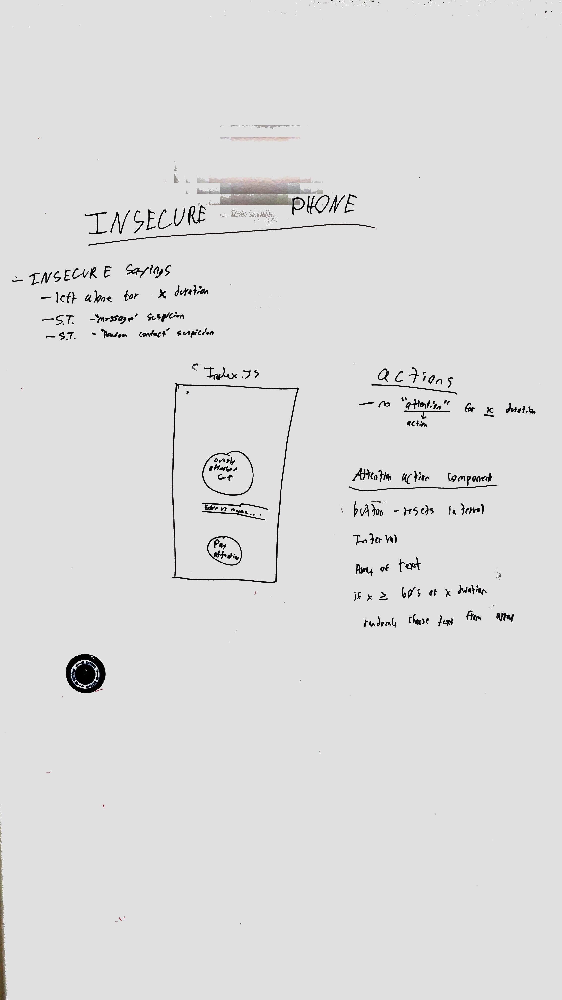

 LAB 
=================================================

## Insecure Phone

### Author: Spencer Hirata and Alexander White

### Links and Resources
* [repo](https://github.com/shiratap/insecurePhone)

### Description
Ever wonder what our phones are feeling when they are left alone or behind? Are they content by themselves? Of course not, phones are insecure AF! We have a designed a way for your phone to express its insecurity, you're welcome.

### Modules
#### `App.js`

###### `giveAttention -> Reset Interval`
`giveAttention` clears the interval and sets the interval again in state

###### `breakUp -> Stop Interval`
`breakUp` clears the interval and speaks a goodbye text

### Setup
1. Clone down the repo
2. Open CLI and enter `npm i`

#### Running the app
* `npm start`

### UML
